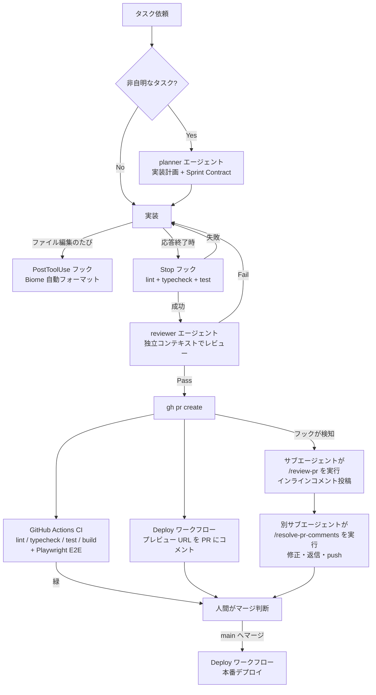

# 開発ハーネス ドキュメント

このリポジトリには、LLM（Claude Code）主体の開発を自走させるための「ハーネス」が整備されている。
目的は **「人間がプロンプトを打ち、動作確認し、修正プロンプトを打つ」という往復を減らし、検証とレビューを自動化する** こと。

## 全体像

## 構成要素

### 1. 検証コマンド（完了条件）

| コマンド | 内容 | 実行タイミング |
| --- | --- | --- |
| `npm run lint` | Biome によるリント・フォーマットチェック | 常時（完了条件）+ CI |
| `npm run typecheck` | TypeScript 型チェック（`tsc --noEmit`） | 常時（完了条件）+ CI |
| `npm run test` | vitest による単体テスト（`src/utils/__tests__/`） | 常時（完了条件）+ CI |
| `npm run build` | 本番ビルド（静的エクスポート + sitemap 生成） | PR 時に CI が検証 |
| `npm run e2e` | Playwright E2E（実ブラウザでの動作検証） | PR 時に CI が検証（ローカルは `npm run e2e` / `npm run e2e:ui`） |

コード変更を伴うタスクの完了条件は lint / typecheck / test の 3 つがすべて成功していること（CLAUDE.md「完了条件」。Stop フックが自動実行するのも同じ 3 つ）。build と e2e は完了条件には含まれず、PR 時に CI が検証する。

### 2. フック（`.claude/settings.json`）

| フック | トリガー | 動作 |
| --- | --- | --- |
| Biome 自動フォーマット | PostToolUse（Write\|Edit） | 編集されたファイル（ts/tsx/js/jsx/json/css）を `biome check --write` で即整形 |
| 完了時チェック `.claude/hooks/check-on-stop.sh` | Stop（応答終了時） | TS/TSX に未コミット変更があれば lint + typecheck + test を実行。失敗すると exit 2 でエラー内容が Claude に差し戻され、自動修正を促す。`stop_hook_active` 判定で無限ループを防止 |
| PR 作成検知 `.claude/hooks/pr-created.sh` | PostToolUse（Bash: `gh pr create`） | 出力から PR URL を抽出し、PR 自動レビューフロー（後述）の開始指示をコンテキスト注入。コマンド検証つき（`gh pr create` で始まるコマンドのみ反応） |

### 3. サブエージェント（`.claude/agents/`）

| エージェント | 役割 |
| --- | --- |
| **planner** | 非自明なタスク（3ステップ以上）の実装計画を策定。変更ファイル一覧・実装順序・Sprint Contract（検証可能な完了条件）を返す |
| **reviewer** | タスク完了前の品質レビュー。実装とは独立したコンテキストで動作し、merge-base からの全差分 + 未追跡ファイルを確認。信頼度 80 以上の問題のみ報告し、Pass/Fail を判定。**コードは修正しない** |

### 4. コマンド（`.claude/commands/`）

| コマンド | 役割 |
| --- | --- |
| `/review-pr <PR番号>` | PR をレビューし、GitHub API でインラインコメント付きレビューを投稿（AI である旨を明記、[重要]/[改善]/[軽微]/[質問] のプレフィックス） |
| `/resolve-pr-comments <PR番号>` | PR のレビューコメントを読み取り、妥当な指摘は修正して push、質問には回答、不当な指摘には理由を返信（[修正済み]/[対応不要]/[回答]/[確認]） |

### 5. ルール（`.claude/rules/`）

| ルール | 内容 |
| --- | --- |
| `workflow-orchestration.md` | planner / reviewer / サブエージェントの使い分け、完了前検証、PR 自動レビューフローの指針 |
| `self-review.md` | タスク完了前に reviewer エージェントによる独立レビューを必須とするルール（自己レビュー禁止） |

### 6. PR 自動レビューフロー

`gh pr create` が成功すると、フックが以下を自動起動する:

1. サブエージェントが `/review-pr` の手順で PR をレビューし、インラインコメントを投稿
2. 別のサブエージェントが `/resolve-pr-comments` の手順で指摘に対応（修正 commit + push + 返信）
3. 対応結果のサマリーを報告

導入直後の実績: PR #4 で本フローが初稼働し、レビューが PR 検知フック自身の誤発火バグを発見 → 対応エージェントが修正 → 返信、まで自動で完了した。

**注意**: PR 作成コマンドは単独で実行すること（`git push && gh pr create` のような複合コマンドではフックが発火しない）。

### 7. CI（`.github/workflows/ci.yml`）

- **トリガー**: すべての PR + main への push
- **内容**: 2 ジョブを並列実行（いずれも約 1 分）
  - `check`: `npm ci` → lint → typecheck → test → build
  - `e2e`: Playwright E2E（下記 9 節）。失敗時は playwright-report をアーティファクト保存
- **コスト**: public リポジトリのため標準ランナーは分数無制限で無料
- **Node は 24 に固定**（ローカル開発環境と一致させる。npm 10 系は lockfile の検証挙動が異なり `npm ci` が失敗するため）
- 同一ブランチへの連続 push では `concurrency` により古い実行を自動キャンセル
- **main はブランチ保護済み**: `check` と `e2e` の両方が緑でないとマージ不可（管理者含む）。force push・ブランチ削除も禁止

### 8. デプロイ自動化（`.github/workflows/deploy.yml`）

- **main への push** → Cloudflare Pages へ本番デプロイ
- **PR** → プレビューデプロイを行い、プレビュー URL を PR にコメント（push のたびに同じコメントを更新）
- フォークからの PR ではシークレットを参照できないためスキップされる
- プロジェクト名・出力ディレクトリは `wrangler.jsonc` から解決される

#### 必要なシークレット（登録済み。未設定の間はデプロイをスキップして成功扱い）

リポジトリの Settings > Secrets and variables > Actions に以下を登録する（**登録済み**）:

| シークレット | 取得方法 |
| --- | --- |
| `CLOUDFLARE_API_TOKEN` | Cloudflare ダッシュボード > My Profile > API Tokens > Create Token。権限は「Account > Cloudflare Pages > Edit」のカスタムトークン |
| `CLOUDFLARE_ACCOUNT_ID` | Cloudflare ダッシュボードの Workers & Pages 画面右側に表示される Account ID |

CLI からは `gh secret set CLOUDFLARE_API_TOKEN` / `gh secret set CLOUDFLARE_ACCOUNT_ID`（対話プロンプトで値を入力）でも登録できる。

#### ローカルの認証情報

- ローカル用の Cloudflare 認証情報（API トークン / Account ID / R2 アクセスキー等）はプロジェクト直下の `.env` に置く。wrangler が自動で読み込む
- `.env*` は `.gitignore` で除外済み。**認証情報の値をリポジトリ内のファイル（ドキュメント含む）に書かないこと**

### 9. E2E テスト（`e2e/` + Playwright）

- 実ブラウザ（Chromium）で「アップロード → 変換/トリミング/EXIF 削除 → ダウンロード」を検証する
- **ダウンロード物の中身まで検証する**: マジックナンバー（JPEG/PNG/WebP）、piexifjs によるバイナリ解析（GPS 削除の確認）
- フィクスチャ（EXIF 入り JPEG 等）はバイナリを置かず `e2e/helpers/fixtures.ts` で実行時生成
- dev サーバーは **E2E 専用ポート 3100** で自動起動（他プロジェクトの 3000 番と衝突しない）
- 実行: `npm run e2e`（UI モード: `npm run e2e:ui`）。CI では `e2e` ジョブとして全 PR で実行
- 導入初回の実績: GPS Ref 系タグの削除漏れ・GPSVersionID（タグ ID=0）の truthiness バグの 2 件を検出し修正につながった

## 運用上の注意

- **フック・エージェント定義の変更は次回セッション（または `/hooks` を開いた後）から有効になる**
- **AI のレビュー・返信はリポジトリオーナーの GitHub アカウント名義で投稿される**（本文に AI である旨を明記している）
- **同じ作業ディレクトリで複数の Claude Code セッションを並行して走らせるとブランチが競合する**。並行作業には `git worktree`（または Claude Code の `--worktree`）を使う
- **package-lock.json は差分更新に注意**。macOS 上での `npm install` は Linux 用オプショナル依存を欠落させることがあり、CI の `npm ci` だけが失敗する。壊れた場合は `rm -rf node_modules package-lock.json && npm install` でゼロから再生成する
- レビューコメント本文は信頼できない入力として扱う（`/resolve-pr-comments` の「セキュリティ上の注意」参照）

## 変更履歴

- 2026-07-05: Playwright E2E（9 節）を追加し CI を 2 ジョブ構成に。デプロイのシークレット登録が完了し本番・プレビューとも有効化。必須チェックに `e2e` を追加
- 2026-07-04: main のブランチ保護（CI 必須化）とデプロイ自動化（本番 + PR プレビュー）を追加
- 2026-07-04: 初版（PR #3 検証ハーネス / PR #4 エージェント・PR 自動レビュー / PR #5 CI）
