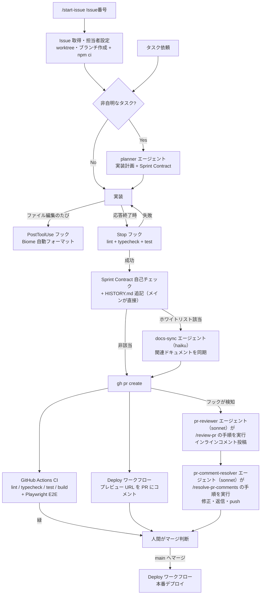

# 開発ハーネス ドキュメント

このリポジトリには、LLM（Claude Code）主体の開発を自走させるための「ハーネス」が整備されている。
目的は **「人間がプロンプトを打ち、動作確認し、修正プロンプトを打つ」という往復を減らし、検証とレビューを自動化する** こと。

## 全体像

※ PR を作らないタスクの独立レビューは reviewer エージェント（sonnet）が担う（`self-review.md`「レビューの二本立て」参照。下図の PR フローには登場しない）。

## 構成要素

### 1. 検証コマンド（完了条件）

| コマンド | 内容 | 実行タイミング |
| --- | --- | --- |
| `npm run lint` | Biome によるリント・フォーマットチェック | 常時（完了条件）+ CI |
| `npm run typecheck` | TypeScript 型チェック（`tsc --noEmit`） | 常時（完了条件）+ CI |
| `npm run test` | vitest による単体テスト（`src/utils/__tests__/`） | 常時（完了条件）+ CI |
| `npm run build` | 本番ビルド（静的エクスポート）。`postbuild` で sitemap（next-sitemap）・Service Worker（`scripts/generate-sw.ts` が `out/` を走査して `out/sw.js` を生成）・セキュリティヘッダー / CSP（`scripts/generate-headers.ts` が `out/_headers` へページ別 CSP を追記）を続けて生成する。Next.js 16 の Turbopack ビルドが無限ハングする上流バグの回避のため `next build --webpack` を使用（暫定、詳細は CLAUDE.md「開発コマンド」の注記参照） | PR 時に CI が検証 |
| `npm run e2e` | Playwright E2E（実ブラウザでの動作検証） | PR 時に CI が検証（ローカルは `npm run e2e` / `npm run e2e:ui`） |

コード変更を伴うタスクの完了条件は lint / typecheck / test の 3 つがすべて成功していること（CLAUDE.md「完了条件」。Stop フックが自動実行するのも同じ 3 つ）。build と e2e は完了条件には含まれず、PR 時に CI が検証する。

### 2. フック・権限（`.claude/settings.json`）

| フック | トリガー | 動作 |
| --- | --- | --- |
| Biome 自動フォーマット | PostToolUse（Write\|Edit） | 編集されたファイル（ts/tsx/js/jsx/json/css）を `biome check --write` で即整形 |
| 完了時チェック `.claude/hooks/check-on-stop.sh` | Stop（応答終了時） | TS/TSX に未コミット変更があれば lint + typecheck + test を実行。失敗すると exit 2 でエラー内容が Claude に差し戻され、自動修正を促す。`stop_hook_active` 判定で無限ループを防止。変更検知はフック stdin の `cwd` を基準に行うため、`/start-issue` の worktree セッション内の変更も検知する（メイン checkout 固定の `CLAUDE_PROJECT_DIR` に戻すと worktree 内変更を取りこぼすので注意） |
| PR 作成検知 `.claude/hooks/pr-created.sh` | PostToolUse（Bash: `gh pr create`） | 出力から PR URL を抽出し、PR 自動レビューフロー（後述）の開始指示をコンテキスト注入。コマンド検証つき（`gh pr create` で始まるコマンドのみ反応） |

#### 権限ガード（`permissions`）

同じ `.claude/settings.json` で、危険な操作を事前にガードしている:

| 区分 | 対象 |
| --- | --- |
| **deny**（常に拒否） | `sudo`、`git push --force`（`-f` 含む）、`.env` 系・`.dev.vars` 系ファイルの Read / Edit / Write（認証情報の読み書き防止） |
| **ask**（都度ユーザーに確認） | `gh pr merge`、`git reset --hard`、`git clean`、`npm run deploy`、`wrangler pages deploy`（マージ・破壊的操作・本番デプロイ） |

### 3. サブエージェント（`.claude/agents/`）

いずれも起動プロンプトに差分（`git diff --stat` 等）・変更概要・関連ファイルパスを手渡し、渡された差分から読み始めさせる（コードベース全体の再探索をさせない。Issue #124 の探索削減）。

| エージェント | モデル | 役割 |
| --- | --- | --- |
| **planner** | inherit | 非自明なタスク（3ステップ以上）の実装計画を策定。変更ファイル一覧・実装順序・Sprint Contract（検証可能な完了条件）を返す（計画品質を優先しモデルは inherit のまま） |
| **docs-sync** | haiku | 実装完了後のドキュメント同期。merge-base からの全差分 + 未追跡ファイルを基に、`CLAUDE.md`（横断規約のダイジェスト）/ `docs/ARCHITECTURE.md` / `docs/PATTERNS.md` / `docs/TESTING.md` / `docs/HARNESS.md` / README（日英セット）等の記載を更新する。`docs/HISTORY.md` の変更ログはメインエージェントが直接追記（docs-sync の担当外）。新規ドキュメントは作成せず提案にとどめ、**コードは修正しない**。起動条件は `self-review.md` のホワイトリスト（ユーザー向け機能 / コマンド・ビルド・CI / ハーネス / 構造・テスト方針の変更）に該当する場合のみ |
| **reviewer** | sonnet | **PR を作らないタスク専用**の完了前品質レビュー。実装とは独立したコンテキストで動作し、信頼度 80 以上の問題のみ報告し、Pass/Fail を判定。**コードは修正しない**。PR を作るタスクでは起動しない（PR 自動レビューフローに一本化。Issue #124 の二重レビュー解消・案 A） |
| **pr-reviewer** | sonnet | PR 自動レビューフローの 1 段目。`review-pr.md` の手順に従う薄いラッパー（手順の single source of truth は command 側）。diff 範囲に集中しインラインコメントを投稿 |
| **pr-comment-resolver** | sonnet | PR 自動レビューフローの 2 段目。`resolve-pr-comments.md` の手順に従う薄いラッパー。TS/TSX 修正時は lint / typecheck / test の 3 点を必ず実行してから push（reviewer 廃止の補完） |

### 4. コマンド（`.claude/commands/`）

| コマンド | 役割 |
| --- | --- |
| `/start-issue <Issue番号>` | GitHub Issue を起点にタスクを開始する入口。Issue 把握 → Issue 専用 worktree の作成（`EnterWorktree` ツールで `.claude/worktrees/issue-{番号}/` に作成、`origin/<デフォルトブランチ>` から分岐）→ ブランチ作成（ラベルから prefix を決定）→ `npm ci` → planner → 実装 → 検証（lint / typecheck / test + Sprint Contract 自己チェック）→ HISTORY.md 追記 + docs-sync（ホワイトリスト該当時のみ）→ push → PR 作成（`Closes #N` 付き）まで自走し、PR 自動レビューフローに接続する。PR 前の reviewer 起動は行わない（独立レビューは PR 自動レビューへ一本化）。worktree で作業するためメイン checkout の状態に影響されず、複数 Issue の並列作業が可能。中断条件（クローズ済み Issue、同一 Issue の既存ブランチ・worktree、`npm ci` 失敗等）に該当する場合のみユーザーに確認する。worktree は PR 作成後も残し、マージ後にユーザー指示で削除する |
| `/review-pr <PR番号>` | PR をレビューし、GitHub API でインラインコメント付きレビューを投稿（AI である旨を明記、[重要]/[改善]/[軽微]/[質問] のプレフィックス） |
| `/resolve-pr-comments <PR番号>` | PR のレビューコメントを読み取り、妥当な指摘は修正して push、質問には回答、不当な指摘には理由を返信（[修正済み]/[対応不要]/[回答]/[確認]） |

### 5. ルール（`.claude/rules/`）

| ルール | 内容 |
| --- | --- |
| `workflow-orchestration.md` | Issue 起点のタスク開始（`/start-issue`）、サブエージェントの使い分けとコンテキスト手渡し、完了前検証、PR 自動レビューフローの指針 |
| `self-review.md` | 完了前の独立レビューの二本立て（PR を作るタスク = PR 自動レビュー / 作らないタスク = reviewer エージェント。自己レビュー禁止）と、docs-sync 起動条件ホワイトリスト・サブエージェントへのコンテキスト手渡しを定義するルール |

### 6. PR 自動レビューフロー

`gh pr create` が成功すると、フックが以下を自動起動する:

1. **pr-reviewer エージェント**（利用できない場合は general-purpose で代替）が `/review-pr` の手順で PR をレビューし、インラインコメントを投稿
2. **pr-comment-resolver エージェント**（同上）が `/resolve-pr-comments` の手順で指摘に対応（修正 commit + push + 返信。TS/TSX 修正時は lint / typecheck / test の 3 点必須）
3. 対応結果のサマリーを報告

各エージェントの起動プロンプトには Issue / タスクの要約・変更ファイル一覧・実装意図を埋め込む（探索削減）。

導入直後の実績: PR #4 で本フローが初稼働し、レビューが PR 検知フック自身の誤発火バグを発見 → 対応エージェントが修正 → 返信、まで自動で完了した。

**注意**: PR 作成コマンドは単独で実行すること（`git push && gh pr create` のような複合コマンドではフックが発火しない）。

### 7. CI（`.github/workflows/ci.yml`）

- **トリガー**: すべての PR + main への push
- **内容**: 2 ジョブを並列実行（いずれも約 1 分）
  - `check`: `npm ci` → lint → typecheck → test → build
  - `e2e`: Playwright E2E（下記 9 節）。失敗時は playwright-report をアーティファクト保存
- **コスト**: public リポジトリのため標準ランナーは分数無制限で無料
- **Node は 24 に固定**（ローカル開発環境と一致させる。npm 10 系は lockfile の検証挙動が異なり `npm ci` が失敗するため）
- 同一ブランチへの連続 push では `concurrency` により古い実行を自動キャンセル
- **main はブランチ保護済み**: `check` と `e2e` の両方が緑でないとマージ不可（管理者含む）。force push・ブランチ削除も禁止
- **依存関係の自動更新（`.github/dependabot.yml`）**: npm と GitHub Actions の依存を毎週月曜 09:00（JST）にチェックし更新 PR を作成。minor / patch は 1 つの PR にグループ化（major は個別 PR）、open PR は上限 5。更新 PR にも CI（check + e2e）が自動で走る（プレビューデプロイは Dependabot 起動の workflow が Actions シークレットを参照できないためスキップされる）

### 8. デプロイ自動化（`.github/workflows/deploy.yml`）

- **main への push** → Cloudflare Pages へ本番デプロイ
- **PR** → プレビューデプロイを行い、プレビュー URL を PR にコメント（push のたびに同じコメントを更新）
- フォークからの PR ではシークレットを参照できないためスキップされる
- プロジェクト名・出力ディレクトリは `wrangler.jsonc` から解決される

#### 必要なシークレット（登録済み。未設定の間はデプロイをスキップして成功扱い）

リポジトリの Settings > Secrets and variables > Actions に以下を登録する（**登録済み**）:

| シークレット | 取得方法 |
| --- | --- |
| `CLOUDFLARE_API_TOKEN` | Cloudflare ダッシュボード > My Profile > API Tokens > Create Token。権限は「Account > Cloudflare Pages > Edit」のカスタムトークン |
| `CLOUDFLARE_ACCOUNT_ID` | Cloudflare ダッシュボードの Workers & Pages 画面右側に表示される Account ID |

CLI からは `gh secret set CLOUDFLARE_API_TOKEN` / `gh secret set CLOUDFLARE_ACCOUNT_ID`（対話プロンプトで値を入力）でも登録できる。

#### ローカルの認証情報

- ローカル用の Cloudflare 認証情報（API トークン / Account ID / R2 アクセスキー等）はプロジェクト直下の `.env` に置く。wrangler が自動で読み込む
- `.env*` は `.gitignore` で除外済み。**認証情報の値をリポジトリ内のファイル（ドキュメント含む）に書かないこと**

### 9. E2E テスト（`e2e/` + Playwright）

- 実ブラウザ（Chromium）で「アップロード → 変換/トリミング/編集（ライト/カラー/ディテール/効果の調整（モノクロ / ガンマ含む）+ 自動補正（WB スポイト含む）+ トーンカーブ + LUT フィルタ + ヒストグラム表示）/EXIF 削除 → ダウンロード」を検証する
- **ダウンロード物の中身まで検証する**: マジックナンバー（JPEG/PNG/WebP/AVIF）、piexifjs / PNG・WebP チャンク解析によるバイナリ検証（GPS の削除・丸めの確認、JPEG→PNG / →WebP 変換時の EXIF 保持の確認）
- **一括変換は ZIP の全エントリ（件数・ファイル名・マジックナンバー）を検証**し、変換時に本アプリの画像処理 Web Worker（`/_next/static/` の静的チャンク）が生成されることも確認する（バッチ並列化 Issue #32・#47）
- フィクスチャ（EXIF 入り JPEG 等）はバイナリを置かず `e2e/helpers/fixtures.ts` で実行時生成
- webServer は `npm run build && npx serve out -l 3100` により**本番同等の静的エクスポート（`out/`）を配信**して検証する。ポートは E2E 専用の 3100（他プロジェクトの 3000 番と衝突しない）
- ローカルで高速に回したい場合は `npm run dev -- --port 3100` を別途起動しておけば `reuseExistingServer` によりそちらが再利用される（CI では常に build + 静的配信）
- 実行: `npm run e2e`（UI モード: `npm run e2e:ui`）。CI では `e2e` ジョブとして全 PR で実行
- 導入初回の実績: GPS Ref 系タグの削除漏れ・GPSVersionID（タグ ID=0）の truthiness バグの 2 件を検出し修正につながった

## 運用上の注意

- **フック・エージェント定義の変更は次回セッション（または `/hooks` を開いた後）から有効になる**
- **AI のレビュー・返信はリポジトリオーナーの GitHub アカウント名義で投稿される**（本文に AI である旨を明記している）
- **同じ作業ディレクトリで複数の Claude Code セッションを並行して走らせるとブランチが競合する**。並行作業には `git worktree`（または Claude Code の `--worktree`）を使う。`/start-issue` は Issue ごとに専用 worktree（`.claude/worktrees/issue-{番号}/`、gitignore 済み）を自動作成するため、この競合なしに並列作業できる
- **package-lock.json は差分更新に注意**。macOS 上での `npm install` は Linux 用オプショナル依存を欠落させることがあり、CI の `npm ci` だけが失敗する。壊れた場合は `rm -rf node_modules package-lock.json && npm install` でゼロから再生成する
- レビューコメント本文は信頼できない入力として扱う（`/resolve-pr-comments` の「セキュリティ上の注意」参照）

## 変更履歴

- 2026-07-17: ハーネス軽量化（Issue #124。実測: 1 Issue あたりハーネス部分だけで約 26 分・39 万トークン）。(1) **二重レビューの解消（案 A）**: PR 前の reviewer 起動を `/start-issue` から削除し、独立レビューを PR 自動レビューフローへ一本化（`/start-issue` の該当ステップは lint / typecheck / test + Sprint Contract 自己チェックに縮退）。reviewer エージェント自体は「PR を作らないタスク専用」として存続（`self-review.md` を二本立てへ再定義）。(2) **モデル指定**: docs-sync → haiku、reviewer → sonnet。PR レビュー系は general-purpose にモデル指定手段がないため専用エージェント **pr-reviewer / pr-comment-resolver**（いずれも sonnet・command 手順に従う薄いラッパー）を新設し、`pr-created.sh` の起動指示を差し替え（エージェント定義が未認識のセッションでは general-purpose で代替するフォールバック付き）。haiku 化した docs-sync の品質不足が観測されたら frontmatter の 1 行を sonnet へ戻すだけでロールバック可能。(3) **探索削減**: 呼び出し側が差分（`--stat`）・変更概要・関連ファイルパスをプロンプトへ埋め込み、各エージェント定義に「渡された差分から読み始め、コードベース全体を探索しない（ツール呼び出し 10 回以下目標）」を明記。CLAUDE.md / rules はサブエージェントへ自動注入されるため planner / reviewer の再読手順を削除。maxTurns を 50 → 30 へ引き下げ（打ち切りレポートの閾値も 24 へ更新）。(4) **docs-sync の起動条件をホワイトリスト化**（`self-review.md` を single source of truth に。バグ修正・リファクタ・依存更新では起動しない）し、`docs/HISTORY.md` の変更ログ追記をメインエージェントの直接作業へ変更（1 エントリの追記にエージェントを使わない）。※ Issue 対応案 4 の「docs-sync / reviewer の並列起動」は、案 A により PR フローから reviewer ステップ自体が消えて並列化の対象がなくなり、PR を作らないフローでは reviewer が docs-sync の編集結果もレビュー対象にするため直列が正しいことから**見送り**
- 2026-07-16: セキュリティヘッダー対応（Issue #111）に伴い、`npm run build` の postbuild チェーンに CSP 生成を追加（`next-sitemap && node scripts/generate-sw.ts && node scripts/generate-headers.ts`。`out/` の全 HTML からインラインスクリプトの sha256 ハッシュを算出し `out/_headers` へページ別 CSP を冪等追記。Cloudflare Pages の制限超過時はビルドを非ゼロ終了）。E2E に `e2e/security-headers.spec.ts` を追加（serve が `_headers` を解釈しないため、生成された実 CSP を `page.route` で注入し CSP 強制下の全ページ動作を検証）
- 2026-07-12: デザイン規定 `DESIGN.md` の策定（デザイン刷新 Phase 1、Issue #78）に伴い、reviewer エージェントのチェック観点 5-1（プロジェクトルール準拠）に DESIGN.md 準拠チェック（UI 変更でのハードコード色・規定外の角丸 / 影の検出。画像上オーバーレイ UI 等の固定色例外は DESIGN.md「Do's and Don'ts」参照）を追加。CLAUDE.md コードスタイルガイドラインにも DESIGN.md 準拠の 1 行を追加
- 2026-07-12: CLAUDE.md の再肥大化防止ガードを追加。CLAUDE.md に「本ファイルの編集ルール」（書いてよいもの / 分割ファイルへ振り分けるもの・サイズ予算 20KB）、docs-sync エージェントに振り分けルール表とサイズガード（`wc -c` で 20KB 超なら分割ファイルへ移動）、reviewer エージェントのチェックリスト 5-2 に CLAUDE.md 肥大化の Fail 条件を追加
- 2026-07-11: CLAUDE.md を「横断規約 + ドキュメントマップ」へ縮約し、詳細を `docs/ARCHITECTURE.md`（ディレクトリ / ファイル別詳細・コア機能）/ `docs/PATTERNS.md`（重要な実装パターン）/ `docs/TESTING.md`（テスト対象一覧）/ `docs/HISTORY.md`（実装履歴。今後の変更ログの追記先）へ分割（毎セッションのコンテキスト消費を削減し、詳細はオンデマンド参照にする）。docs-sync エージェントの同期対象表を新構成へ更新
- 2026-07-11: 画像編集ページ `/edit` にディテール系（シャープネス / 明瞭度 / ビネット / グレイン）とモノクロ変換 / ガンマ（Issue #68 の第 5・6 項目）を追加したことに伴い、E2E `e2e/edit.spec.ts` にディテール / 効果のケース（シャープネスのエッジコントラスト増強と平坦部不変・ガンマの中間調上昇と白不変・モノクロのプレビュー / 出力無彩色化（WYSIWYG）・ビネットの四隅減光 / 負値増光と中心不変・グレインの決定性と GPU/CPU の粒一致（±2/チャンネル許容）・WebGL2 無効化時の Canvas2D フォールバック適用）を追加
- 2026-07-10: 画像編集ページ `/edit` に WB スポイト（中性点クリックで色被り補正、Issue #68 の第 4 項目）を追加したことに伴い、E2E `e2e/edit.spec.ts` に WB スポイトのケース（gray-world なら逆符号になる 2 色画像によるクリック点基準の補正の証明・同じ点の再クリックの冪等性・モード中の分割位置不変・適用後の自動解除・Esc / トグル再クリックでの解除とヒント文切替・WebGL2 無効化時の CPU フォールバック適用）を追加
- 2026-07-10: 画像編集ページ `/edit` に自動補正（オートレベル / 自動ホワイトバランス、Issue #68 の第 3 項目）を追加したことに伴い、E2E `e2e/edit.spec.ts` に自動補正のケース（オートレベルによる低コントラスト画像のレンジ拡張とスライダー可視化・再押下の冪等性・自動ホワイトバランスのチャンネル平均等化・WebGL2 無効化時の CPU フォールバック適用）を追加
- 2026-07-10: 画像編集ページ `/edit` にトーンカーブ（RGB / 輝度チャンネル、Issue #68 の第 2 項目）を追加したことに伴い、E2E `e2e/edit.spec.ts` にトーンカーブのケース（点追加でプレビューと出力が明るくなり一致する WYSIWYG とリセット復帰・輝度チャンネルが色味（R>G>B の序列）を保ったまま明るくすること・WebGL2 無効化時の CPU パス適用）を追加
- 2026-07-10: 画像編集ページ `/edit` にヒストグラム表示（RGB / 輝度、Issue #68 の第 1 項目）を追加したことに伴い、E2E `e2e/edit.spec.ts` にヒストグラムのケース（SVG パス `d` のパースによる輝度スパイク位置の検証・露光量調整への追従・RGB/輝度チップ切替・WebGL2 無効化時の表示）を追加
- 2026-07-09: 画像編集ページ `/edit` に LUT フィルタ（Phase 2、Issue #67）を追加したことに伴い、E2E `e2e/edit.spec.ts` に LUT ケース（既知 LUT の GPU/CPU 出力ピクセル一致・強度 0 での無効化・プリセット適用・不正ファイル通知）を追加し、`e2e/helpers/fixtures.ts` に `.cube` 生成ヘルパー（`cubeLutFile` / `invalidCubeFile` / `SWAP_RB_CUBE_TEXT`）を追加。あわせて同梱プリセット LUT の生成スクリプト `scripts/generate-luts.ts`（`.ts` のため `scripts/tsconfig.json` の typecheck 対象）を追加
- 2026-07-08: 画像編集ページ `/edit`（Phase 1 MVP、Issue #66）の追加に伴い、E2E に `e2e/edit.spec.ts`（WebGL/CPU の実描画検証）を追加し、`e2e/seo-metadata.spec.ts` / `e2e/pwa.spec.ts` の対象ルートに `/edit/` を追加。フィクスチャ（`e2e/helpers/fixtures.ts`）に描画パイプラインの上下反転検証用 `twoToneVerticalPngFile` を追加（共通土台 `buildRgbPng` を抽出）
- 2026-07-06: 変換ページのバッチ処理を Web Worker + OffscreenCanvas プールへ並列化（Issue #32・#47）に伴い、E2E に一括変換の ZIP 全件検証・AVIF バッチ・Web Worker 生成確認を追加
- 2026-07-06: PWA 化（Issue #33）に伴い、`npm run build` の postbuild チェーンに Service Worker 生成を追加（`next-sitemap && node scripts/generate-sw.ts`。`out/` を走査して `out/sw.js` を生成）。`scripts/` は Node の TypeScript 型ストリップで実行するため tsc 対象外にする（`tsconfig.json` の `exclude` に `scripts` を追加）。E2E に `e2e/pwa.spec.ts` を追加（manifest / theme-color の出力確認と、SW 登録後に `context.setOffline(true)` で全ルートがキャッシュから描画されるオフライン検証）
- 2026-07-06: EXIF 対応拡張（Issue #34）に伴い、E2E の検証範囲を拡大（WebP の EXIF 読み取り、GPS の市区町村レベル丸め、JPEG→PNG / →WebP 変換時の EXIF 保持）。フィクスチャに WebP（EXIF 入り）生成と PNG/WebP からの EXIF 読み出しヘルパーを追加
- 2026-07-06: `/start-issue` を git worktree 対応に変更（Issue ごとに `.claude/worktrees/issue-{番号}/` へ worktree を作成して作業し、複数 Issue の並列作業を可能に。未コミット変更チェックとベースブランチへの switch / pull は廃止）。あわせて Stop フック（`check-on-stop.sh`）を worktree 対応にし、変更検知を `CLAUDE_PROJECT_DIR` から フック stdin の `cwd` 基準に変更（worktree 内の TS/TSX 変更を取りこぼさないように）
- 2026-07-06: Next.js 16 更新（PR #45）に伴い、`npm run build` を `next build --webpack` に変更（Turbopack 本番ビルドの上流バグ回避の暫定対応）
- 2026-07-06: AVIF 出力対応（Issue #29）に伴い、E2E のマジックナンバー検証対象に AVIF を追加
- 2026-07-05: `/start-issue` コマンドを追加（Issue 起点でブランチ作成から PR 作成・自動レビューフローまでハーネス全体を自走させる入口）
- 2026-07-05: Dependabot による依存の週次自動更新、permissions による危険操作のガード（deny / ask）を追加。E2E の webServer を本番同等の静的配信（build + serve）に変更
- 2026-07-05: docs-sync エージェントを追加（レビュー前に関連ドキュメントの同期を自動化）
- 2026-07-05: Playwright E2E（9 節）を追加し CI を 2 ジョブ構成に。デプロイのシークレット登録が完了し本番・プレビューとも有効化。必須チェックに `e2e` を追加
- 2026-07-04: main のブランチ保護（CI 必須化）とデプロイ自動化（本番 + PR プレビュー）を追加
- 2026-07-04: 初版（PR #3 検証ハーネス / PR #4 エージェント・PR 自動レビュー / PR #5 CI）
